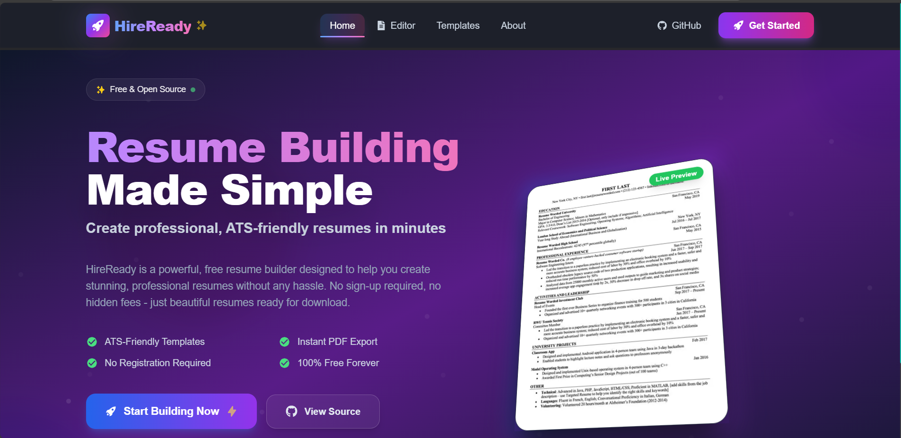
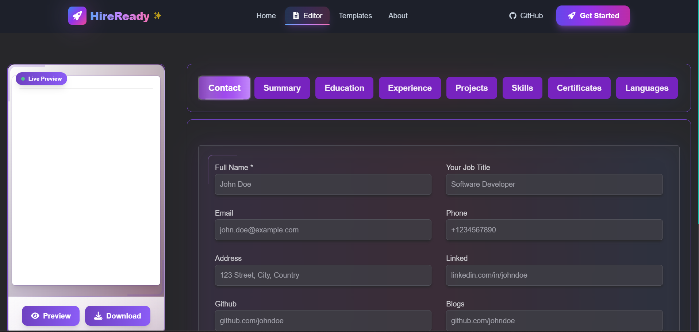

# Resume Builder

A modern, customizable resume builder web app built with Next.js, React, and Tailwind CSS. Instantly create, edit, and download beautiful resumes with live preview and multiple templates.

## Features

- 📝 **Live Resume Editor**: Add, edit, and remove sections in real time.
- 🎨 **Multiple Templates**: Choose from a variety of professional resume templates.
- 👀 **Instant Preview**: See your changes live as you edit.
- 📄 **Export as PDF/HTML**: Download your resume in PDF or HTML format.
- 💾 **Auto-Save**: Your progress is saved automatically in the browser.
- 🌙 **Dark Mode**: Enjoy a beautiful dark theme for late-night editing.
- ⚡ **Fast & Responsive**: Built with Next.js App Router and optimized for all devices.

## Tech Stack

- [Next.js 13+ (App Router)](https://nextjs.org/)
- [React 18+](https://react.dev/)
- [Tailwind CSS](https://tailwindcss.com/)
- [Redux Toolkit](https://redux-toolkit.js.org/)
- [Framer Motion](https://www.framer.com/motion/)

## Getting Started

1. **Clone the repository:**
   ```bash
   git clone https://github.com/Shanidhya01/Resume-Builder.git
   cd Resume-Builder
   ```
2. **Install dependencies:**
   ```bash
   npm install
   # or
   yarn install
   ```
3. **Run the development server:**
   ```bash
   npm run dev
   # or
   yarn dev
   ```
4. **Open in browser:**
   Visit [http://localhost:3000](http://localhost:3000)

## Project Structure

- `app/` - Next.js app directory (pages, layouts, templates)
- `components/` - Reusable UI and editor components
- `store/` - Redux store and slices
- `config/` - Resume field configuration
- `public/` - Static assets and templates
- `utils/` - Utility functions

## Screenshots




## Contributing

Contributions are welcome! Please open an issue or submit a pull request.

## License

This project is licensed under the MIT License.

---

> Made with ❤️ by Shanidhya
